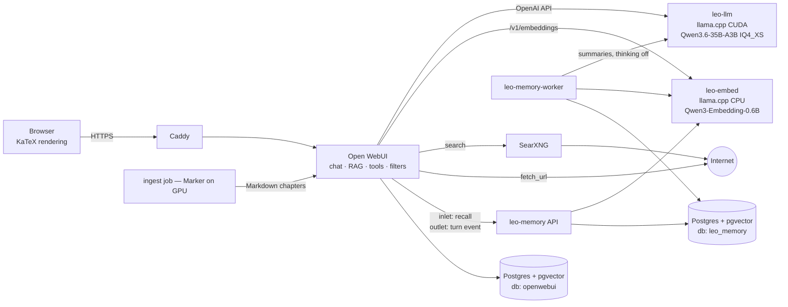

# Leo, a private math & algorithms study assistant project

Leo is a self-hosted AI tutor and research assistant that runs entirely on one workstation. It reasons through mathematics and algorithm analysis, searches the web, studies the books you give it, quizzes you until you actually understand, and remembers what you studied across sessions.

Leo is **fast by default**: it answers directly, without a long hidden reasoning phase. A **Think** button in the chat box switches on deep reasoning for proofs and hard analysis. All mathematics is **rendered as typeset equations** in the browser.

| | |
|---|---|
| **Model** | Qwen3.6-35B-A3B (MoE, 3B active), GGUF `UD-IQ4_XS` (17.7 GB), served as `leo` |
| **Inference** | llama.cpp `llama-server` (CUDA), expert offload to system RAM, tuned per machine |
| **UI** | Open WebUI in the browser, behind Caddy (HTTPS) |
| **Math rendering** | KaTeX in the browser. Leo writes one canonical LaTeX style, a normalizer filter repairs the rest, and automated browser tests verify it (§9.3) |
| **Modes** | Direct answers by default;  Think toggle for deep reasoning (bounded budget) |
| **Web search** | Self-hosted SearXNG |
| **Books** | Marker (PDF → Markdown + LaTeX) → Open WebUI Knowledge (hybrid search + reranking) |
| **Memory** | `leo-memory` service: concise per-chat summaries, learner profile, pinned facts in Postgres + pgvector |
| **Storage** | PostgreSQL 17 + pgvector (two databases: `openwebui`, `leo_memory`) |
| **Deployment** | Docker Compose, everything pinned, one `make` command per operation |

---

## 1. Host requirements

| Component | Requirement | Target machine |
|---|---|---|
| GPU | NVIDIA, 12 GB VRAM minimum, current driver (R550+) | RTX 3080 Ti 12 GB |
| CPU | 6+ cores with AVX2 | i7-8700 (6C/12T, UHD 630 iGPU) |
| System RAM | ~17 GB free for the stack (24 GB+ total recommended) | 39 GB total, ~27 GB free |
| Disk | ~50 GB free on an SSD | — |
| OS | Linux with NVIDIA Container Toolkit, **or** Windows 11 + WSL2 + Docker Desktop (WSL2 backend) | — |

**RAM budget (estimates, to be verified in Phase 2)**

| Component | RAM |
|---|---|
| `leo-llm`: MoE experts not on the GPU + vision encoder on CPU | ~9–11 GB |
| Open WebUI + reranker model | ~3–4 GB |
| `leo-embed` | ~0.7 GB |
| Postgres, SearXNG, Caddy, memory service | ~1 GB |
| **Total** | **~14–17 GB** |

**Windows / WSL2 specifics (must do):**

- Clone and run this repo **inside the WSL2 filesystem** (e.g. `~/leo`), never under `/mnt/c`.
- WSL2 caps its VM at 50% of host RAM by default (~19.5 GB here), which is too tight. Create `%UserProfile%\.wslconfig`, then run `wsl --shutdown` and restart Docker Desktop:
  ```ini
  [wsl2]
  memory=24GB
  swap=8GB
  ```
- Enable GPU support in Docker Desktop (WSL integration) and confirm with `make check`.

**Free speed from hardware you already have** (`make check` reports on these; the user applies them):

1. **Run the monitor from the motherboard's display port** (i7-8700 integrated graphics, enabled in BIOS). This frees 0.5–1.5 GB of the 3080 Ti's VRAM for model experts.
2. **Memory bandwidth.** Offloaded experts run at the speed of system RAM:
   - Modules should be in dual-channel slots.
   - Enable XMP in the BIOS if the board supports it (Z370/Z390 usually do; H/B-series chipsets are limited to DDR4-2666).
   - A total of 39 GB suggests mixed module sizes. Intel "Flex Mode" then runs the unmatched part single-channel. `make check` prints the module layout (Linux: `dmidecode -t memory`; Windows: Task Manager → Memory, or `wmic memorychip get capacity,speed,devicelocator`) and explains the impact.

---

## 2. Architecture



**Networks**

| Network | Members | Internet |
|---|---|---|
| `frontend` | caddy, open-webui | yes (Caddy ports) |
| `backend` (`internal: true`) | open-webui, leo-llm, leo-embed, postgres, leo-memory, leo-memory-worker, bootstrap, ui-test | **no** |
| `egress` | open-webui, searxng, models-fetch, ingest | yes |

**Request flow (one chat turn)**

1. Browser → Caddy → Open WebUI.
2. Filters on the way in:
   - `Leo Memory` (global) injects a compact `<leo_memory>` block.
   - `Think` (a toggle; only when switched on) enables reasoning for this request.
3. Open WebUI calls `leo-llm` with native tool calling. By default the server has **thinking disabled**, so replies start immediately.
4. On the way out, the `Leo LaTeX` normalizer (global) rewrites math delimiters into the canonical style that renders reliably, both while streaming (if supported) and on the final message. The browser renders the math with KaTeX.
5. The `Leo Memory` outlet posts the turn to `leo-memory` (fire-and-forget). After `MEMORY_IDLE_SECONDS` of inactivity, the worker compresses it into the chat's concise summary.

---

## 3. Repository layout

```
leo/
├── README.md
├── CLAUDE.md                        # written at the end of the build
├── .env.example                     # all config, versions pinned, secrets as __GENERATE__
├── .gitignore                       # .env, data/, library/*/, backups/
├── Makefile
├── compose.yaml
├── compose.debug.yaml               # optional: exposes leo-llm/leo-memory on 127.0.0.1 for debugging
├── docs/
│   ├── DEVIATIONS.md
│   ├── OPERATIONS.md                # runbook: backup, restore, upgrade, tuning
│   ├── TUNING.md                    # generated by `make tune`
│   ├── LATEX.md                     # generated by `make test-ui`: render matrix results + chosen canonical style
│   └── latex-render.png             # screenshot of the rendered fixture
├── services/
│   ├── caddy/Caddyfile
│   ├── llm/entrypoint.sh
│   ├── postgres/init/01-init.sh
│   ├── searxng/settings.yml
│   ├── memory/                      # FastAPI API + worker (one image, two commands)
│   │   ├── Dockerfile
│   │   ├── pyproject.toml
│   │   ├── migrations/0001_init.sql
│   │   ├── src/leo_memory/
│   │   │   ├── settings.py  db.py  migrate.py
│   │   │   ├── api.py       worker.py
│   │   │   ├── summarizer.py  recall.py  profile.py
│   │   │   ├── llm.py       embeddings.py  sanitize.py
│   │   │   └── schemas.py
│   │   └── tests/
│   ├── openwebui/                   # provisioned into Open WebUI by bootstrap
│   │   ├── functions/leo_memory_filter.py
│   │   ├── functions/leo_think_toggle.py
│   │   ├── functions/leo_latex_normalizer.py
│   │   ├── tools/leo_memory_tools.py
│   │   ├── models/leo.json
│   │   ├── prompts/leo_system_prompt.md
│   │   └── tests/test_latex_normalizer.py   # imports the function file via importlib
│   ├── bootstrap/                   # idempotent provisioning via Open WebUI API
│   │   ├── Dockerfile
│   │   └── bootstrap.py
│   └── ingest/                      # book conversion + upload
│       ├── Dockerfile
│       └── ingest.py
├── tests/
│   └── ui/                          # Playwright browser tests (math rendering, basic UI)
│       ├── test_latex_render.py
│       ├── test_live_math.py
│       └── fixtures/latex_matrix.md
├── scripts/
│   ├── init-env.sh  check-host.sh  fetch-models.sh
│   ├── tune.sh      smoke-test.sh
│   └── backup.sh    restore.sh
├── library/
│   ├── inbox/  markdown/  processed/  manifest.json
├── data/models/                     # GGUF files (gitignored)
└── backups/                         # gitignored
```

---

## 4. Configuration `.env.example`

`make init` copies this to `.env`, replaces every `__GENERATE__` with `openssl rand -hex 32` (admin password: 24 random URL-safe chars, **≤ 72 bytes** because of bcrypt), prints the admin password once, and sets `chmod 600 .env`.

---

## 5. Models

`make models` runs `models-fetch`, which uses `hf download` to place these files in `data/models/`:

| File | Repo | Size | Purpose |
|---|---|---|---|
| `Qwen3.6-35B-A3B-UD-IQ4_XS.gguf` (verify) | `unsloth/Qwen3.6-35B-A3B-GGUF` | 17.7 GB | Leo |
| `mmproj-F16.gguf` (verify name) | same | ~0.9 GB | Vision (photos of handwritten work) |
| `Qwen3-Embedding-0.6B-Q8_0.gguf` (verify) | `Qwen/Qwen3-Embedding-0.6B-GGUF` | ~0.6 GB | Embeddings for books and memory |

The script lists the repo files first and fails loudly if a configured filename doesn't exist. It is resumable and skips files already present.

`make models-extra` fetches **optional A/B candidates** for `make tune`. Ask before downloading.
- An **MTP-enabled** GGUF at a similar size (check Unsloth's and ggml-org's Qwen3.6-35B-A3B MTP repos).
- `UD-IQ3_XXS` (13.2 GB), the speed candidate.

**Qwen3.6 facts the build relies on:**

- Thinking is controlled per request with `chat_template_kwargs: {"enable_thinking": true|false}`. The `/think` and `/nothink` soft switches are not supported.
- Recommended sampling:
  - Thinking, general: `temp 1.0, top_p 0.95, top_k 20, presence_penalty 1.5`
  - Non-thinking, general: `temp 0.7, top_p 0.8, top_k 20, presence_penalty 1.5`

---

## 6. Memory subsystem (`leo-memory`)

### 6.1 Goals

- **Remember across chats** without replaying transcripts. Memory is *short and concise*: one summary of at most 60 words per chat, plus a small learner profile and pinned facts.
- **Cheap at runtime.** Recall is one vector query and injects at most 1,500 characters. Summarization runs only when the chat is idle, with thinking off.
- **User control.** A per-user on/off toggle, "what do you remember about me?", forget a chat or everything, export as JSON.

### 6.2 Two layers of history

| Layer | Where | Content |
|---|---|---|
| Full transcripts | `openwebui` DB | Every message. Required for the chat sidebar. Backed up. |
| Concise memory | `leo_memory` DB | Per-chat summary, learner profile, pinned facts, all embedded for recall |

Open WebUI's built-in "Memory" feature is **disabled**, so `leo-memory` is the single source of truth.

### 6.3 Schema — `migrations/0001_init.sql`

Migrations are applied by the API at startup under `pg_advisory_lock`.

### 6.4 HTTP API

All routes except health require `Authorization: Bearer $LEO_MEMORY_TOKEN`. Logs never contain message text at INFO level.

| Method | Path | Purpose |
|---|---|---|
| POST | `/v1/events/turn` | `{chat_id, user_id, title?, messages[]}` → 202. Sanitize, then upsert the job |
| GET | `/v1/recall?user_id&q&exclude_chat_id` | → `{block, items}` |
| GET | `/v1/chats/{chat_id}/summary` | One summary |
| DELETE | `/v1/chats/{chat_id}` | Forget one chat |
| POST / GET / DELETE | `/v1/facts`, `/v1/facts/{id}` | Pinned facts |
| GET | `/v1/users/{user_id}/export` | Everything stored about the user, as JSON |
| DELETE | `/v1/users/{user_id}` | Wipe all memory for the user |
| GET | `/healthz`, `/readyz` | Liveness / readiness |

### 6.5 Ingest and debounce (`/v1/events/turn`)

1. **Skip** temporary chats (no `chat_id`, or a `local:` prefix) and users with memory disabled.
2. **Sanitize**:
   - Drop system messages.
   - Strip thinking blocks, `<source>` blocks, tool payloads and base64 images.
   - Cap each message at 2,000 characters.
3. **Select new content**: messages after `last_message_id` if ids exist; otherwise the most recent messages up to `MEMORY_MAX_INPUT_CHARS`.
4. **Upsert the job**: `status='pending'`, `updated_at=now()`, `run_after = LEAST(now()+idle, first_pending_at+max_wait)`.

### 6.6 Worker loop (`worker.py`)

```
every 5 s:
  claim one due job: set status='running' (commit immediately; no lock held during the LLM call)
  if leo-llm is busy (/slots or /metrics — verify which exists) or unhealthy: requeue in 30 s
  summary = summarizer.run(previous_summary, job.payload)          # thinking off
  embed(title + summary + topics) → upsert memory.chat_summaries
  profile.merge(user_id, summary.weak_spots, summary.mastered)
  DELETE the job WHERE updated_at = claimed_version; if 0 rows → a newer turn arrived → set pending
  on error: exponential backoff (cap 30 min); after 5 attempts → status='dead'
hourly: retention purge; reconcile deleted chats
```

### 6.7 Chat deletion sync

Bootstrap grants `leo_reconcile` `SELECT (id)` on Open WebUI's chat table (verify the name). Reconcile deletes summaries for chats that no longer exist. If the table can't be found, it logs a warning and is skipped.

### 6.8 Summarizer (`summarizer.py`)

- Call `POST {LLM_BASE_URL}/chat/completions` with:
  - `model: leo`
  - `chat_template_kwargs: {"enable_thinking": false}`
  - `temperature 0.7, top_p 0.8, top_k 20, presence_penalty 1.5, max_tokens 500`
  - `response_format` = JSON schema of `SummaryV1`
- Validate with Pydantic and enforce the limits in code. Retry once, then fail the job.

System prompt:

```text
You compress a tutoring conversation into durable memory for a study assistant.
Return ONLY JSON matching the schema.

Rules:
- summary: at most {max_words} words, third person ("The user…"), covering what was studied and where they ended.
- key_points: at most 5 facts worth remembering later (goals, deadlines, preferences, conclusions), each ≤ 20 words.
- topics: at most 6 short lowercase tags (e.g. "dijkstra", "master theorem").
- weak_spots: at most 3 concepts the user answered wrongly or was unsure about.
- mastered: at most 3 concepts the user demonstrated correctly under questioning.
- open_questions: at most 3 unresolved threads to pick up next time.
- If previous_summary is given, MERGE: update and replace outdated items; do not append blindly.
- Exclude greetings, tool logs, citations, reasoning traces, and anything the user asked to forget.
- Write plain text (no LaTeX) in English regardless of the conversation language; keep technical terms exact.
```

### 6.9 Learner profile merge (`profile.py`, deterministic)

- Concepts are normalized (lowercase, trimmed, simple singularization).
- Each weak spot → `count += 1`, `last_seen = now`.
- Each mastered item is added to `mastered` and decrements a matching weak spot (removed at 0).
- Keep at most 15 items per list, ranked by `count × recency_decay` (half-life 30 days).

### 6.10 Recall (`recall.py`)

1. Embed the latest user message. For trivial messages, use recency instead.
2. Summaries: the 20 nearest, excluding the current chat.
   - `score = 0.7·sim + 0.3·exp(-age_days/30)`
   - Take the top `MEMORY_RECALL_TOP_K` with `sim ≥ 0.35`.
3. Facts: the 5 nearest with `sim ≥ 0.3`, plus the 2 most recent.
4. Profile: the top 5 weak spots and top 3 mastered.
5. Render within `MEMORY_MAX_INJECT_CHARS`:

```text
<leo_memory>
Profile — weak: dijkstra relaxation order (×3), master theorem case 2 · strong: big-O notation
Past sessions:
- 2026-09-20 "Dijkstra practice": The user implemented Dijkstra with a binary heap; confused relaxation with visiting order; open: negative edges.
Pinned: Algorithms exam on 2026-11-12. Prefers proofs before code.
</leo_memory>
```

### 6.11 Open WebUI filter — `functions/leo_memory_filter.py`

A **global** filter, also attached to Leo. Its valves are `memory_url`, `memory_token`, `enabled`, `inlet_timeout_s=1.5`, `outlet_timeout_s=1.0` and `priority=0`; its user valve is `memory_enabled`.

- **inlet**:
  1. Bail out for disabled, anonymous or temporary chats.
  2. Recall using the last user message.
  3. Add the `<leo_memory>` block as its own system message after the model's system prompt. Verify the ordering in the pinned middleware.
  4. On any error, return the body unchanged.
- **outlet**: fire-and-forget `POST /v1/events/turn`. Never raise, never modify the body.

Use an HTTP client the pinned Open WebUI image already ships. Don't add requirements.

### 7.12 Open WebUI tools — `tools/leo_memory_tools.py`

- `remember(fact)` — pin a fact. Use only when the user explicitly asks.
- `forget(query)` — delete matching facts or summaries and confirm what was removed.
- `what_do_you_remember()` — return the user's profile, facts and the 5 most recent session summaries.

---

## 7. Library ingestion (books)

Leo **retrieves** from your books at question time and cites them. It does not train on them.

**`make ingest`**

1. `docker compose stop leo-llm` to free VRAM. A `trap` guarantees `start leo-llm` on exit.
2. For each new file in `library/inbox/` (PDF, EPUB, DOCX; deduplicated by sha256):
   - Convert with **Marker** in `INGEST_MARKER_MODE`. Equations become LaTeX, and scanned pages are OCR'd.
   - Post-process:
     - Split into one Markdown file per chapter: `<book-slug>__ch03-shortest-paths.md`.
     - Prepend YAML front matter: `title, author, source_file, chapter, sha256`.
     - Drop images; keep captions.
     - Run the same `normalize_math()` used by the LaTeX filter (§9.3), so quoted book passages render cleanly.
3. Upload to the Knowledge base `LEO_KNOWLEDGE_NAME` (files API, then knowledge add-file; verify the routes and poll for completion).
4. Move originals to `library/processed/`, update `manifest.json`, and print a summary table.

Other commands: `make library` and `make library-remove BOOK=<slug>`. The `INGEST_CONVERTER=mineru` path is optional. Marker's code and weights have their own licenses; personal use is fine.

---

## 8. Provisioning Open WebUI (`make bootstrap`)

`bootstrap.py` is idempotent. It uses the Open WebUI REST API with the admin account from `.env`. Verify the routes in the pinned version's `backend/open_webui/routers/`.

1. Wait for `open-webui` and `leo-memory` to be healthy. Sign in.
2. Upsert **function** `leo_memory_filter`: valves from `.env`, active and global.
3. Upsert **function** `leo_think_toggle` (§9.2): active, attached to Leo, shown as a toggle button.
4. Upsert **function** `leo_latex_normalizer` (§9.3): active, **global**, and ordered to run **last** on outlet/stream. Its valve `inline_style` comes from `LEO_MATH_INLINE` (or `docs/LATEX.md` if present).
5. Upsert **tool** `leo_memory_tools`.
6. Ensure the **Knowledge base** `LEO_KNOWLEDGE_NAME` exists.
7. Upsert the **workspace model** `leo-study`, named **Leo**:
   - Base model `leo`.
   - Params: `temp 0.7, top_p 0.8, top_k 20, min_p 0, presence_penalty 1.5, max_tokens 8192`, native function calling.
   - System prompt from `prompts/leo_system_prompt.md`, with the math-style placeholders filled in (§9.3).
   - Attached: the Leo Library knowledge base, the memory and Think filters, and the memory tools.
   - Capabilities: vision, file upload, citations, web search, code interpreter.
8. Hide the raw base model `leo` from the picker and set `leo-study` as the default.
9. Grant `leo_reconcile` `SELECT (id)` on Open WebUI's chat table.
10. Disable the built-in Memory feature.
11. Print a summary.

**Config precedence:** many Open WebUI settings are "ConfigVars" (the database wins after first boot), so bootstrap sets the critical settings via the API. `make reset-config` restarts once with `RESET_CONFIG_ON_START=true`.

### 9.1 `prompts/leo_system_prompt.md`

`{{…}}` placeholders are filled in by bootstrap from the chosen math style.


### 9.2 Think toggle — `functions/leo_think_toggle.py`

A filter shown as a **Think** button in the chat input, which runs only while switched on. Verify the toggle and icon attribute names in the pinned version.

