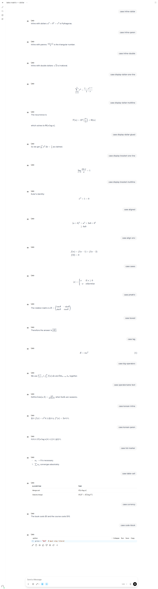

# LaTeX rendering matrix

Generated by `make test-ui` on 2026-09-26 13:49 KST against `http://open-webui:8080` (Open WebUI `v0.11.4`), headless Chromium.

Each fixture case (`tests/ui/fixtures/latex_matrix.md`) is rendered as an assistant message **raw** (as a model might write it) and **normalized** by `leo_latex_normalizer` in each inline style. A math case passes when KaTeX rendered it, with no `.katex-error` and no raw delimiters left in the text.

| Case | Expect | raw | dollar | paren | double |
|---|---|---|---|---|---|
| `inline-dollar` | math | ✅ 1 formula(s) | ✅ 1 formula(s) | ✅ 1 formula(s) | ✅ 1 formula(s) |
| `inline-paren` | math | ✅ 1 formula(s) | ✅ 1 formula(s) | ✅ 1 formula(s) | ✅ 1 formula(s) |
| `inline-double` | math | ✅ 1 formula(s) | ✅ 1 formula(s) | ✅ 1 formula(s) | ✅ 1 formula(s) |
| `display-dollar-one-line` | math | ✅ 1 formula(s) | ✅ 1 formula(s) | ✅ 1 formula(s) | ✅ 1 formula(s) |
| `display-dollar-multiline` | math | ✅ 2 formula(s) | ✅ 2 formula(s) | ✅ 2 formula(s) | ✅ 2 formula(s) |
| `display-dollar-glued` | math | ✅ 1 formula(s) | ✅ 1 formula(s) | ✅ 1 formula(s) | ✅ 1 formula(s) |
| `display-bracket-one-line` | math | ✅ 1 formula(s) | ✅ 1 formula(s) | ✅ 1 formula(s) | ✅ 1 formula(s) |
| `display-bracket-multiline` | math | ✅ 1 formula(s) | ✅ 1 formula(s) | ✅ 1 formula(s) | ✅ 1 formula(s) |
| `aligned` | math | ✅ 1 formula(s) | ✅ 1 formula(s) | ✅ 1 formula(s) | ✅ 1 formula(s) |
| `align-env` | math | ❌ no math rendered | ✅ 1 formula(s) | ✅ 1 formula(s) | ✅ 1 formula(s) |
| `cases` | math | ✅ 1 formula(s) | ✅ 1 formula(s) | ✅ 1 formula(s) | ✅ 1 formula(s) |
| `pmatrix` | math | ✅ 1 formula(s) | ✅ 1 formula(s) | ✅ 1 formula(s) | ✅ 1 formula(s) |
| `boxed` | math | ✅ 1 formula(s) | ✅ 1 formula(s) | ✅ 1 formula(s) | ✅ 1 formula(s) |
| `tag` | math | ✅ 1 formula(s) | ✅ 1 formula(s) | ✅ 1 formula(s) | ✅ 1 formula(s) |
| `big-operators` | math | ✅ 3 formula(s) | ✅ 3 formula(s) | ✅ 3 formula(s) | ✅ 3 formula(s) |
| `operatorname-text` | math | ✅ 2 formula(s) | ✅ 2 formula(s) | ✅ 2 formula(s) | ✅ 2 formula(s) |
| `korean-inline` | math | ✅ 2 formula(s) | ✅ 2 formula(s) | ✅ 2 formula(s) | ✅ 2 formula(s) |
| `korean-paren` | math | ✅ 1 formula(s) | ✅ 1 formula(s) | ✅ 1 formula(s) | ✅ 1 formula(s) |
| `list-marker` | math | ✅ 2 formula(s) | ✅ 2 formula(s) | ✅ 2 formula(s) | ✅ 2 formula(s) |
| `table-cell` | math | ✅ 2 formula(s) | ✅ 2 formula(s) | ✅ 2 formula(s) | ✅ 2 formula(s) |
| `currency` | literal | ✅ prices literal | ✅ prices literal | ✅ prices literal | ✅ prices literal |
| `code-block` | code | ✅ code literal | ✅ code literal | ✅ code literal | ✅ code literal |
| **passed** | | **21/22** | **22/22** | **22/22** | **22/22** |

Recommended inline style: `dollar`

Chosen inline style: `dollar` (from `LEO_MATH_INLINE`; bootstrap fills the system prompt and the normalizer valve with this style)

Display math is always canonical: `$$` on its own line, the formula, `$$` on its own line, blank lines around.

Known limits: formulas glued together in the raw text (`$a$$b$`) are ambiguous in any renderer; the normalizer separates them with a space. `double` inline style cannot be made idempotent for adjacent formulas and is not recommended.

